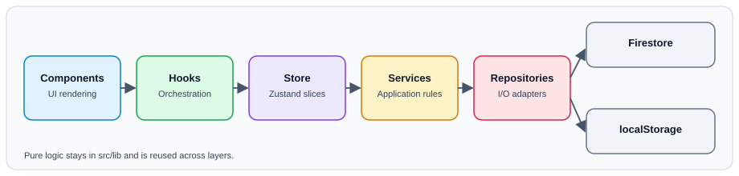
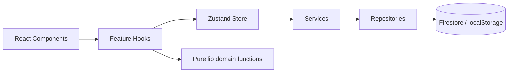

# Architecture

CW-Trainer is a static-exported Next.js app. All business logic runs client-side; Firebase is optional persistence.

## Layered Design

The project follows this dependency direction:

`Components -> Hooks -> Store slices -> Services -> Repositories -> Firebase/localStorage -> lib`

- Components render UI and call hooks.
- Hooks orchestrate view behavior and delegate state changes.
- Store slices hold state and expose actions.
- Services apply business rules and validation.
- Repositories perform storage/network I/O.
- `lib/` contains pure domain logic and utilities.

## Runtime Model

## Core Principles

- Static export constraints: no server-side runtime APIs.
- Offline-first behavior: app should work without Firebase.
- Strict TypeScript: avoid unsafe assumptions and unchecked indexed access.
- Small composable units: split large hooks/components by concern.

## Key Feature Areas

- Training flow: session generation, playback, scoring, results.
- ICR mode: instant character recognition timing and visualization.
- Stats: session aggregation and leaderboard/analytics views.
- Settings: shared audio/training settings with persistence and validation.
